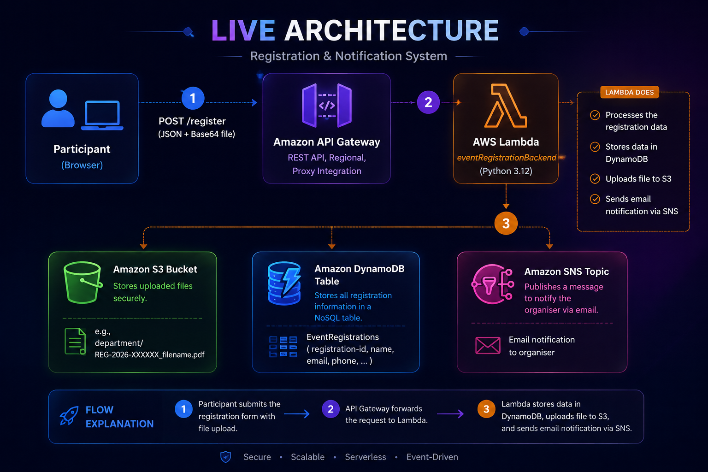
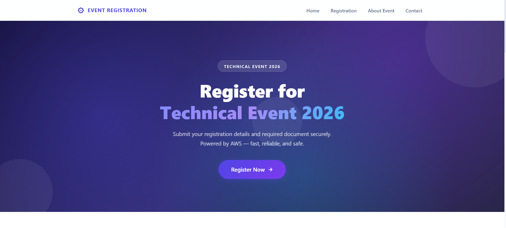
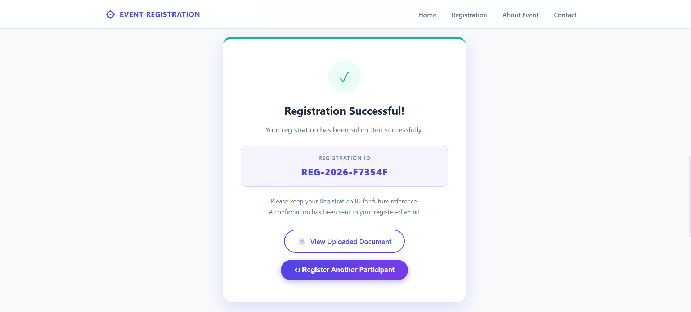

# AWS Event Registration Portal

A fully serverless event registration system built on AWS. Participants fill out a form, upload a document, and receive a registration ID — all processed in real time through API Gateway, Lambda, S3, DynamoDB, and SNS.

  

---

## What We Built

A complete, production-ready event registration portal — no third-party backend, no frameworks, no database servers. Just AWS services wired together with a clean static frontend.

When a participant submits the form:

1. The browser validates all fields client-side before making any network call
2. The document (PDF/image) is encoded as Base64 and sent as part of the JSON payload
3. API Gateway receives the request and proxies it to a Lambda function
4. Lambda validates the data again server-side, generates a unique registration ID, uploads the document to S3, saves the record to DynamoDB, and fires an SNS email to the organiser
5. The participant sees a success card with their registration ID and a direct link to the uploaded document

Everything runs on AWS — no servers to manage, no idle costs, and it scales automatically.

---

## Live Architecture



---

## Screenshots

**Home Page**



**Registration Successful**



---

## Features

**Frontend**
- Responsive UI — plain HTML/CSS/JS, no frameworks, no build step
- Client-side validation for all fields before any network call
- Drag-and-drop file upload with live preview (PDF, JPG, PNG — max 5 MB)
- Three-step progress indicator during submission
- Success card with registration ID + document link; error card with the backend message

**Backend (Lambda)**
- Server-side validation — forged or tampered requests are rejected independently of the frontend
- Registration IDs (`REG-2026-XXXXXX`) generated server-side only
- Compatible with API Gateway REST API (v1) and HTTP API (v2) payload formats
- Auto S3 rollback if DynamoDB write fails — no orphaned files
- SNS failure is non-fatal — a missed email never cancels a completed registration
- Env vars sanitised at cold-start — strips invisible Unicode that causes silent `ValidationException`

**Infrastructure**
- Least-privilege IAM — Lambda scoped to only its own bucket, table, and SNS topic
- No AWS credentials in the frontend — only the public API Gateway URL is exposed

---

## Project Structure

```
AWS_Event_Registration_Form/
├── frontend/
│   ├── index.html              ← Registration portal UI
│   ├── script.js               ← Form logic, validation, API call
│   └── style.css               ← Responsive styles
│
└── backend/
    ├── lambda_function.py      ← Lambda source (deploy this)
    ├── iam_policy.json         ← IAM policy template
    ├── iam_policy_READY_TO_USE.json
    ├── s3_bucket_policy_CORRECTED.json
    └── test_events/
        ├── test_valid_registration.json
        ├── test_missing_field.json
        ├── test_invalid_email.json
        ├── test_invalid_filetype.json
        └── test_cors_preflight.json
```

---

## Tech Stack

**Frontend**


**Backend & Cloud**


**Language**


---

## AWS Setup

### 1 — S3 Bucket

1. **S3 → Create bucket**
2. Name: `event-registration-2026` (must be globally unique — choose your own)
3. Region: choose your preferred region
4. Uncheck **Block all public access** (needed for the document view link)
5. After creation → **Permissions → Bucket policy** → paste:

```json
{
  "Version": "2012-10-17",
  "Statement": [{
    "Sid": "PublicReadDocuments",
    "Effect": "Allow",
    "Principal": "*",
    "Action": "s3:GetObject",
    "Resource": "arn:aws:s3:::event-registration-2026/*"
  }]
}
```

> The Lambda only needs `s3:PutObject` and `s3:DeleteObject`. Public read is granted by the bucket policy above.

---

### 2 — DynamoDB Table

1. **DynamoDB → Create table**
2. Table name: `EventRegistrations`
3. Partition key: `registration-id` (String)
4. Sort key: *(leave empty)*
5. Billing mode: **On-demand**
6. Click **Create table**

---

### 3 — SNS Topic

1. **SNS → Topics → Create topic**
2. Type: **Standard**
3. Name: `EventRegistrationNotification`
4. Click **Create topic** → copy the **Topic ARN**

**Subscribe the organiser's email:**
1. Inside the topic → **Create subscription**
2. Protocol: **Email** → enter the organiser's address
3. Check inbox and click the **confirmation link**

---

### 4 — Lambda Function

1. **Lambda → Create function → Author from scratch**
2. Function name: `EventRegistrationBackend`
3. Runtime: **Python 3.12**
4. Architecture: `x86_64`
5. Click **Create function**

**Deploy the code:**
- Paste the contents of `backend/lambda_function.py` into the inline editor
- Click **Deploy**

**Environment variables** (Configuration → Environment variables → Edit):

| Key             | Example value                                                      |
|-----------------|--------------------------------------------------------------------|
| `BUCKET_NAME`   | `event-registration-2026`                                          |
| `TABLE_NAME`    | `EventRegistrations`                                               |
| `SNS_TOPIC_ARN` | `arn:aws:sns:us-east-1:123456789012:EventRegistrationNotification` |

> Paste values carefully — invisible characters (zero-width spaces, BOM) pasted from some editors will cause a DynamoDB `ValidationException`. The Lambda will log a warning and auto-clean them if found.

**General configuration:**
- Timeout: **30 seconds**
- Memory: **256 MB**

---

### 5 — IAM Role

1. **IAM → Roles** → open the auto-created role for your Lambda  
   (named `EventRegistrationBackend-role-xxxx`)
2. **Add permissions → Create inline policy → JSON tab**
3. Paste `backend/iam_policy.json`, replacing:
   - `REGION` → your AWS region (e.g. `us-east-1`)
   - `ACCOUNT_ID` → your 12-digit AWS account ID
   - `BUCKET_NAME` → your bucket name
4. Name the policy `EventRegistrationPolicy` → **Create policy**
5. Also confirm **AWSLambdaBasicExecutionRole** is attached (for CloudWatch Logs)

---

### 6 — API Gateway

1. **API Gateway → Create API → REST API → Build**
2. API name: `EventRegistrationAPI` | Endpoint type: **Regional**
3. Create resource: `/register`
4. On `/register` → create method: **POST**
   - Integration type: **Lambda Function**
   - ✅ Use Lambda Proxy integration
   - Lambda function: `EventRegistrationBackend`
5. **Actions → Enable CORS** → Access-Control-Allow-Origin: `*`
6. **Actions → Deploy API** → new stage: `prod`
7. Copy the **Invoke URL**:
   ```
   https://<id>.execute-api.<region>.amazonaws.com/prod/register
   ```

---

## Frontend Configuration

Open `frontend/script.js` and set your API URL on line 18:

```js
const API_URL = "https://<id>.execute-api.<region>.amazonaws.com/prod/register";
```

That's the only change needed before going live.

---

## Running Locally

```bash
cd frontend
python -m http.server 8080
```

Open `http://localhost:8080` in your browser.

> No build tools, no npm, no dependencies — just static HTML/CSS/JS.

---

## Testing

### Generate a Base64 test string

**Windows PowerShell:**
```powershell
$b64 = [Convert]::ToBase64String([IO.File]::ReadAllBytes("C:\path\to\test.pdf"))
$b64 | Set-Clipboard
```

**macOS / Linux:**
```bash
base64 -w 0 test.pdf | pbcopy   # macOS
base64 -w 0 test.pdf            # Linux — copy the output
```

Paste the result into the `"fileData"` field of a test event JSON.

---

### Lambda console test

1. Lambda → **Test → Create new test event**
2. Paste `test_events/test_valid_registration.json`
3. Replace `BASE64_DATA` with your real Base64 string
4. Click **Test**

Expected response:
```json
{
  "statusCode": 200,
  "body": "{\"success\": true, \"registration-id\": \"REG-2026-XXXXXX\", \"documentUrl\": \"https://...\"}"
}
```

Run the error-case events to verify validation:

| Test file                    | Expected status |
|------------------------------|-----------------|
| `test_missing_field.json`    | `400`           |
| `test_invalid_email.json`    | `400`           |
| `test_invalid_filetype.json` | `400`           |
| `test_cors_preflight.json`   | `200`           |

---

### API Gateway test (PowerShell)

```powershell
$body = @{
  name       = "Vignesh Kumar"
  email      = "vignesh@college.edu"
  phone      = "9876543210"
  department = "CSE"
  college    = "Karpagam Institute of Technology"
  event      = "Technical Workshop"
  fileName   = "test.pdf"
  fileType   = "application/pdf"
  fileData   = (Get-Content "base64.txt" -Raw)
} | ConvertTo-Json

Invoke-RestMethod -Method POST `
  -Uri "https://<id>.execute-api.<region>.amazonaws.com/prod/register" `
  -ContentType "application/json" `
  -Body $body
```

---

### Verify end-to-end

After a successful form submission:

- ✅ **S3** — file appears at `{department}/REG-2026-XXXXXX_filename.pdf`
- ✅ **DynamoDB** — record with all fields visible under **Explore table items**
- ✅ **SNS** — organiser receives the "New Event Registration" email
- ✅ **CloudWatch** — `/aws/lambda/EventRegistrationBackend` shows the full log trail
- ✅ **Frontend** — success card displays the `REG-2026-XXXXXX` ID and document link

---

## Environment Variables Reference

| Variable        | Description                      | Example                                                            |
|-----------------|----------------------------------|--------------------------------------------------------------------|
| `BUCKET_NAME`   | S3 bucket for uploaded documents | `event-registration-2026`                                          |
| `TABLE_NAME`    | DynamoDB table name              | `EventRegistrations`                                               |
| `SNS_TOPIC_ARN` | Full ARN of the SNS topic        | `arn:aws:sns:us-east-1:123456789012:EventRegistrationNotification` |

---

## Security Notes

- No AWS credentials are stored in the frontend — only the public API Gateway URL
- Registration IDs are generated server-side only — clients cannot supply their own
- File names are sanitised (path traversal blocked, ASCII-normalised, max 100 chars)
- All environment variables are cleaned of invisible Unicode on cold-start
- IAM policy follows least privilege — Lambda can only `PutObject` and `DeleteObject` on its own bucket

---

## Author

**Sri Ganth K**

[](https://www.linkedin.com/in/sri-ganth-k)
[](https://github.com/SRIGANTH-K)
[](https://www.instagram.com/sri_ganth_k)
